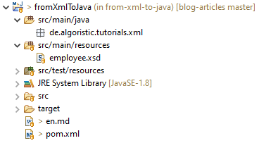
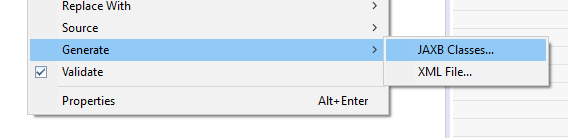
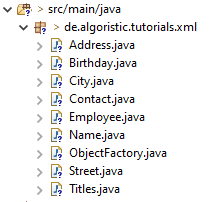

[//]: # (
    don't forget to add links to all related topics, platforms etc.
    add prerequisites after finishing the article -> eclipse, xml, basic java
)

# From XML to Java - done right
## Don't parse XML yourself: let JAXB do that for you!
In this tutorial you will learn:
- how to deserialize **XML** contens to Java objects and vice versa
- how to completely avoid writing your own parser for that purpose (using **JAXB** and the inbuilt features of **Eclipse IDE**)
- the basics of **XSD** (XML Schema Definition)

## Introduction
When it comes to data exchange in various cases you will make use of data in XML format. No matter why you are doing so (in many modern applications you will prefer JSON) there is one thing you shouldn't do: **write you own parser**. Man, I mean, we are *flying to Mars*, you shouldn't parse your data *by hand* in 2019...

The obvious reasons is: there are libraries, that will do that more effiecient and reliable. You can do that for a homework in your studies, but when your boss catches you doing that, you are in need of an explanation. So, ~~if you heard of Java SAX Parser~~ we will use JAXB for that.

## Tutorial
#### Method
1. We start devising an XML structure for our purpose. This is maybe an unpopular approach but definitely has some benefits as you will see.
1. When we are sure our structure fits our needs, we will derive an XSD. This feels maybe a bit unnatural to you, but in fact it is the equivalent of planning such a structure in Java. **Plus**: When we are done, we have a fixed XSD Structure we can give to any involved party, so the data exchange format is clear to everyone<sup>[1](#footnote-1)</sup>. This is *of course* a requirement, when we want to create an understandable and maintainable application (*believe me*, I worked in a company that used bloated XML files for numerous purposes and had no XSD or DTD anywhere... it's no fun to extend such a structure or just to understand the enviroment that has grown to process those files). Besides: when deriving an XSD from an XML you **really** have to think about what you do and how to make it extensible for future developments without making it too generic or overdevelop it.
1. We use the inbuilt features of Eclipse IDE to create our classes.
1. Profit... ?

### Getting Started
I prerequisite you have installed and are using Eclipse IDE. If that is not the case, I highly encourage you to do that, because we will make use of one of its' features. I will be using Eclipse IDE 2019-09 (for [Enterprise Java Developers](https://www.eclipse.org/downloads/packages/release/2019-09/r/eclipse-ide-enterprise-java-developers)) because that is the latest version.

We also need data to work with. For that purpose I come up with a poorly designed XML schema to save information about employees:
```xml
<employee personnelNumber="1337" gender="m">
  <name>
    <titles>
      <title>Prof. Dr.</title>
      <title>Dr.</title>
    </titles>
    <forename>Boba</forename>
    <surname>Fett</surname>
  </name>
  <birthday date="1977-05-04" location="Modesto, California" />
  <contact>
    <address>
      <street houseNumber="1200 - 1298">Tamarind Ave</street>
      <city postalCode="90038" state="CA">Los Angeles</city>
    </address>
  </contact>
</employee>
```
Why do we use a structure like that one above? There is no benefit in developing a sophisticated model here, that would just be overengineering... Also: the above model fits my needs: We will need to make use of some basic features of XSD to develop a schema for that structure. These features will allow you to understand the concept of XSD and will allow you to create a schema for most XML you will face.

As you can see, we will define a structure of so called "Complex Types". A complex type is any node that holds a value more complex, than a single `string` or `int`. Our `employee` is such a type, that holds subnodes of `name`, `birthday` and `contact`. Some nodes will have attributes, some not. Most of the XML is self-explaining, but here are some points, that are maybe not:
- The attribute `gender` of `employee` holds the value of `m` in our example. We will create an XSD that restricts the values of `gender` to `m`, `f` and `d`. That is nice, because it is just semantically correct!. Without any programmed logic we can make sure, that we get only the correct values!
- The type `titles` of `name` contains a list of `title`. This list consists of any number of titles, from none to infinite and will allow us to display any combination of educational degree. (We will restrict the possible values here to `Prof.` and `Dr.`, but only because of my lazyness.)
- The attribute `date` of `birthday` will be automatically validated using the `yyyy-MM-dd` format (see [w3schools.com](https://www.w3schools.com/XML/schema_dtypes_date.asp)) for more information on this).

### Developing the XSD

The complete XSD is to be found here on my [GitHub](place-link-here-when-article-is-moved-to-archive). I will describe the basics of developing an XSD by using selected examples.

Okay, the start is pretty straight forward, we have to define our namespaces and how the document should be verified. I do that in most cases by the following schema:

```xml
<?xml version="1.0" encoding="UTF-8"?>
<xsd:schema xmlns="https://algoristic.de/employee"
  targetNamespace="https://algoristic.de/employee"
  xmlns:xsd="http://www.w3.org/2001/XMLSchema"
  elementFormDefault="qualified">
  <!-- here we are going to define our actual schema -->
</xsd:schema>
```
Here are three things to be recognized:
1. `xmlns` and `targetNamespace` define the namespace the following rules shall be applied to; I'm very uncreative here...
1. `xmlns:xsd` defines the one namespace that is to be used in this XML document. In our case that is the XSD namespace itself, using the prefix `xsd` (but you can actually use any prefix here)
1. `elementFormDefault` defines, if the elements of XML documents that comply with this schema, should all be qualified by this schema. This gets more understandable, when we look at the other way to do this: we could also attribute every element in the schema with `form="qualified"` or leave that out for some elements. The effect would be, that elements attributed with `form=...` would be qualified by our namespace and the ones left out are expected to be in the `null` namespace (and in reality, would just not be qualified...)

Inside this schema we define our elements. We will do that top-down, starting with the type `employee`. There are two basic approaches to define elements with custom types.

The first one is using a nested definition:
```xml
<xsd:element name="employee">
  <xsd:complexType>
    <xsd:attribute name="personnelNumber" type="xsd:int" />
  </xsd:complexType>
</xsd:element>
```
The other one uses type definitions in the same document (resembling Java classes in some ways):
```xml
<xsd:element name="employee" type="employee" >

<xsd:complexType name="employee">
  <xsd:attribute name="personnelNumber" type="xsd:int" />
</xsd:complexType>
```
In almost every case I go for the second approach, for reasons of reusability and transparency. (Once I started with a nested structure but the project got a lot bigger than I expected, so I ended up with a complete mess of an XSD file, to finally just rework that with clear type definitions.) So I will stick to that in this tutorial :)

The `employee` has three sub-elements, namely `name`, `birthday` and `contact`, and the two attributes `personnelNumber` and `gender`. Sub-elements get defined like this:
```xml
<xsd:complexType name="employee">
  <xsd:sequence>
    <xsd:element name="name" type="name" minOccurs="1" maxOccurs="1" />
    <xsd:element name="birthday" type="birthday" minOccurs="1" maxOccurs="1" />
    <xsd:element name="contact" type="contact" minOccurs="0" maxOccurs="1" />
  </xsd:sequence>
</xsd:complexType>
```
When defining sub-elements we always need a `xsd:sequence`, even if there is just one element. We define `name` and `type` like with our first type ('employee') and I highly recommend you to make use of `minOccurs` and `maxOccurs` wherever you can. `minOccurs="0"` tells us, that this element is optional, whilst `minOccurs="1"` obviously means, that this element is required. `maxOccurs="1"` restricts the appearances of this element to _1_, making it a simple property inside a class, thinking in Java references. So `maxOccurs="unbounded"` makes it a List, when translating to Java. Since this are some of the basic components _POJOs_ are made of, you should definitely remember this.

We begin defining the element `name`. As we remember, `name` should consist of a simple forename, surname and a list of titles, so we go for it:

```xml
<xsd:complexType name="name">
  <xsd:sequence>
    <xsd:element name="titles" type="titles" minOccurs="0" maxOccurs="1" />
    <xsd:element name="forename" type="xsd:string" minOccurs="1" maxOccurs="1" />
    <xsd:element name="surname" type="xsd:string" minOccurs="1" maxOccurs="1" />
  </xsd:sequence>
</xsd:complexType>
```
`forename` and `surname` are an easy one: `minOccurs="1" maxOccurs="1"` says, this elements are required and have a single occurence; `type="xsd:string"` tells us we are using a **primitive type** here, instead of our complex types. XSD provides many primitive types, like `xsd:string`, `xsd:int` and `xsd:boolean` but also more specific types like `xsd:date`<sup>[2](#footnote-2)</sup> or `xsd:dateTime`. Eclipse has a nice content assistant here for your relief. I encapsulate `titles` in a complex type instead of using the definition `<xsd:element name="title" minOccurs="0" maxOccurs="unbounded"/>` directly here, because that would produce a list of `title`s on the same layer as fore- and surname and would look like this:
```xml
<name>
  <title>Prof. Dr.</title>
  <title>Dr.</title>
  <forename>Boba</forename>
  <surname>Fett</surname>
</name>
```
This is obviously not that nice. When defining `types` and `type` as complex type we we will make use of the next interesting technique: **value restritions**. They look like this:
```xml
<xsd:complexType name="titles">
  <xsd:sequence>
    <xsd:element name="title" minOccurs="0" maxOccurs="unbounded">
      <xsd:simpleType>
        <xsd:restriction base="xsd:string">
          <xsd:enumeration value="Dr." />
          <xsd:enumeration value="Prof. Dr." />
        </xsd:restriction>
      </xsd:simpleType>
    </xsd:element>
  </xsd:sequence>
</xsd:complexType>
```
I think after seeing some XSD, this is self-explaining. `title` is obviously a primitive type, because we want to store literal values in it. It is convention to nest the restriction itself inside a `xsd:simpleType` element. By the way: `xsd:complexType` allows no restrictions. With `xsd:restriction base="xsd:string"` we define our datatype and enumerate our allowed values inside that element. When we want to allow more titles, we just have to extend that list.

With the lessons above we can construct most of our XSD now, describe our XML. Only one thing left: attributes. Adding the attribute `personnelNumber` our type `employee` will look like this:
```xml
<xsd:complexType name="employee">
  <xsd:sequence>
    <xsd:element name="name" type="name" minOccurs="1" maxOccurs="1" />
    <xsd:element name="birthday" type="birthday" minOccurs="1" maxOccurs="1" />
    <xsd:element name="contact" type="contact" minOccurs="0" maxOccurs="1" />
  </xsd:sequence>
  <xsd:attribute name="personnelNumber" type="xsd:int" />
</xsd:complexType>
```
Attributes are to be defined inside the type definition, **below** the sequence of elements (if there is one). They can be restricted to certain values just like elements with the same syntax:
```xml
<xsd:attribute name="gender">
  <xsd:simpleType>
    <xsd:restriction base="xsd:string">
      <xsd:enumeration value="m" />
      <xsd:enumeration value="f" />
      <xsd:enumeration value="d" />
    </xsd:restriction>
  </xsd:simpleType>
</xsd:attribute>
```
Just one thing that is interesting: Inside complex types, the definition of attributes is a no-brainer. But what's about the elements `street` and `city` in the XML structure? They have simple content and yet also attributes. That can be done, using the following tweak:
```xml
<xsd:complexType name="street">
  <xsd:simpleContent>
    <xsd:extension base="xsd:string">
      <xsd:attribute name="houseNumber" type="xsd:string" />
    </xsd:extension>
  </xsd:simpleContent>
</xsd:complexType>
```
So we just make it a complex type, having simple content. `<xsd:extension base="xsd:string">` tells us, of what type the simple content is. And within that, we define our attributes. That is, admittedly, a little awkward... I always struggle remembering it.

But that's it. With this basics you can construct an XSD for most XML files. When you want to have a look at the complete XSD from our example or you just need a reference, you can get it in my [GitHub](place-link-here-when-article-is-moved-to-archive).

### Generating Classes and XML

After arduously constructing the XSD we come to the easy part! Below is our current project structure:



We only have our empty `de.algoristic.tutorials.xml` package and our XSD file at this point. Now make a right click on the XSD file and choose '_Generate_' > '_JAXB Classes..._'.



In the next step, choose your project, your destination package (`de.algoristic.tutorials.xml` in our case), ignore '_Catalog_' and '_Bindings files_', choose '_No Proxy_' and pick some other options (e. g. I will choose '_Suppress generation of file header_' because that always annoys me and '_Suppress generation of package-info.class_'). After JAXB is done, our package looks like this:



JAXB translates the type definitions to single classes, if you are interested in the generated structure you can look them up in my [GitHub](place-link-here-when-article-is-moved-to-archive). And that is everything we essentially need to do, to translate XML into Java and the other way round.

To work with XML files you just need to now the following lines of code:
```java
Employee employee = JAXB.unmarshal(new File("path/to/your/input-file"), Employee.class); //read in a file
JAXB.marshal(employee, new File("path/to/your/output-file")); //write object to a file
```

**Important**: One thing I always stumble upon: to provide the functionality of JAXB always add your namespace at the root node of the XML file to unmarshal! Our example XML from the beginning would now correctly look like this:
```xml
<employee xmlns="https://algoristic.de/employee"
  personnelNumber="1337" gender="m">
  <name>
    <titles>
      <title>Prof. Dr.</title>
      <title>Dr.</title>
    </titles>
    <forename>Boba</forename>
    <surname>Fett</surname>
  </name>
  <birthday date="1977-05-04" location="Modesto, California" />
  <contact>
    <address>
      <street houseNumber="1200 - 1298">Tamarind Ave</street>
      <city postalCode="90038" state="CA">Los Angeles</city>
    </address>
  </contact>
</employee>
```

### Testing

To approve our project is working I added two basic tests. The first: unmarshalling an existing XML to an object and checking some of its properties on a random basis. The second: constructing the same structure as object, write it to and XML file, re-reading that file and re-checking its properties. To make this a little shorter I will just link the tests on my [GitHub](place-link-here-when-article-is-moved-to-archive).

### Summary

To be honest: this isn't the hot stuff. E. g. when you handle information of type date like in this tutorial you will have to handle the class `XMLGregorianCalendar`, which is a _very_ old 'Date' implementation and there are much better alternatives today. **But** this stuff is rock-solid and when you have to maintain and/or update an older Java application it will help you saving much time!
-----

<sup><a name="footnote-1">1</a></sup> Of course we can archieve that the other way round too. **But** when we start writing our Java classes and annotate them to create an XSD, we will need to make use of third party software that comes as an extra dependency for our application.

<sup><a name="footnote-2">2</a></sup> I make use of `xsd:date` to define the element `birthday`. You can look that up in my [GitHub](place-link-here-when-article-is-moved-to-archive) as mentioned before.
